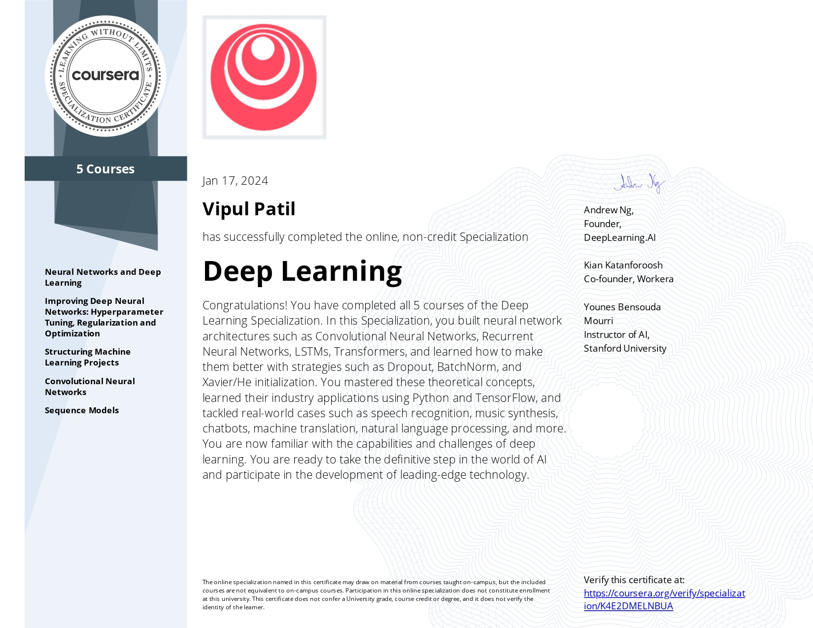
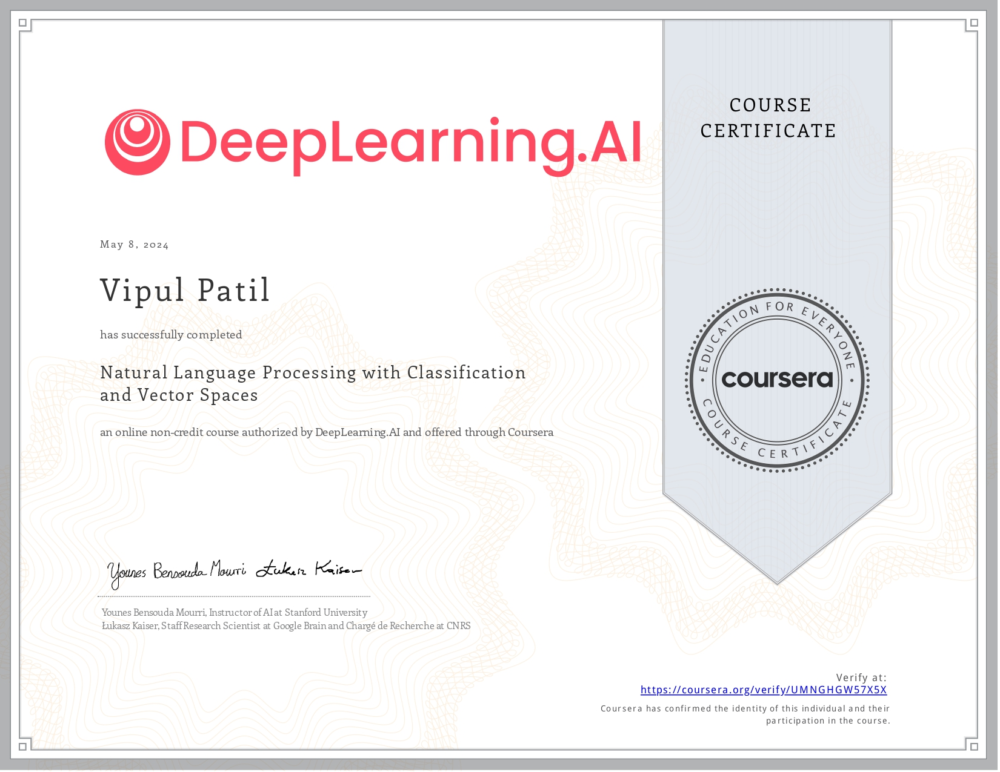
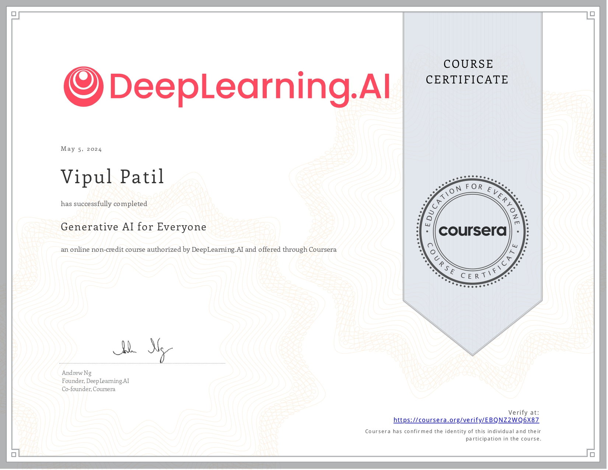
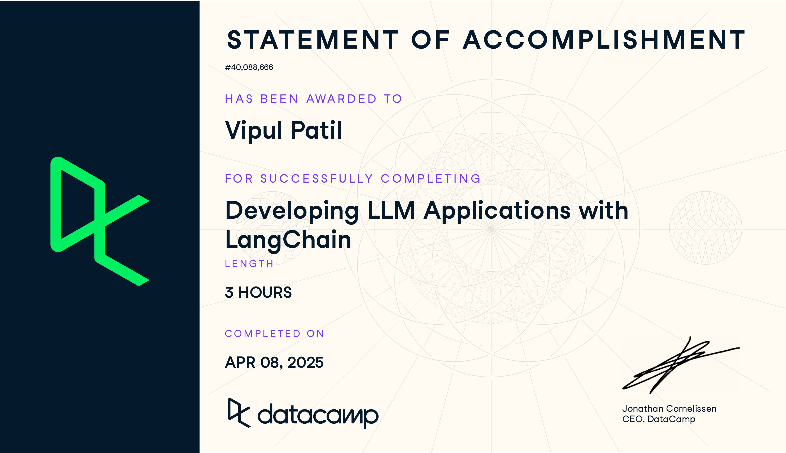
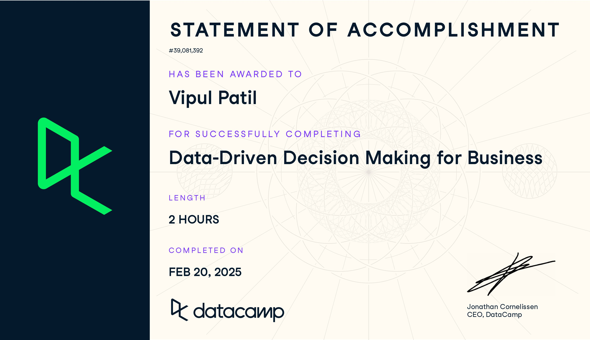
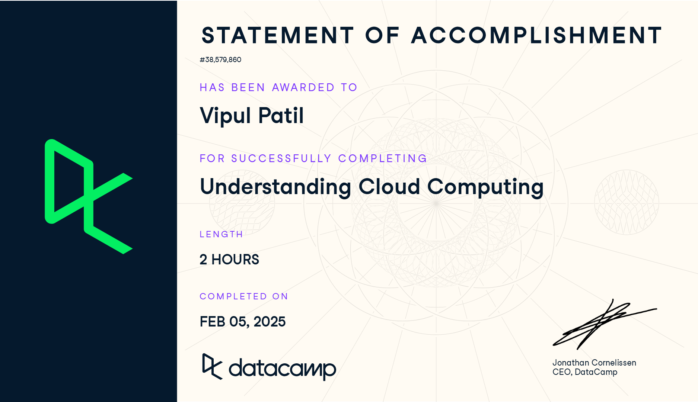

## Hi, I'm **Vipul Patil**👋

```python
class AboutMe:
    def __init__(self):

        self.professional_title = "👨‍💻 Data Scientist with 3+ years of experience in ML and AI"

        self.education = "🎓 MSc in Computational Engineering at FAU Erlangen, Germany (Specialized in Data Science & AI)"

        self.work_summary = "🔧 Built end-to-end ML solutions from Classical ML to Generative AI across multiple domains"

        self.current_role = "💼 Currently at Allianz Global Investors in Munich, building Agentic AI solutions"

        self.industries_experience = [
                                      "🧑‍🤝‍🧑 Customer Analytics",
                                      "🚗 Automotive",
                                      "✈️ Aviation",
                                      "🔬 Research",
                                      "💰 Finance"
                                     ]

        self.technical_passions =    [
                                      "🧠 NLP",
                                      "🤖 LLMs",
                                      "🕸️ Agentic AI",
                                      "🎨 Generative AI",
                                      "⚙️ Intelligent Automation",
                                      "☁️ Cloud",
                                      "🛠️ MLOps"
                                      ] 
```

## 🌐 Socials:
[](https://www.linkedin.com/in/vipul-patil-8a1220195/) [](mailto:vipulpatil7057@gmail.com) 

# 💻 Tech Stack:


  <!-- Placeholder, real icon not yet public -->


# 🏅 Certifications

|  |  |  
|:-------------:|:-------------:|
|  |  |
|  |  | 
|  |  | 


